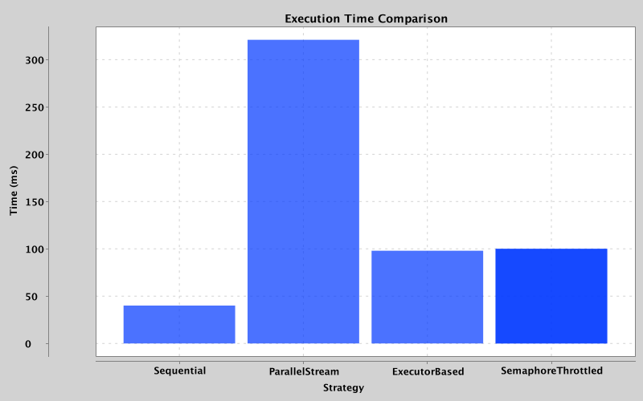

# Big Data Performance Optimization in Java

A modular, benchmark-driven implementation demonstrating performance optimization in Big Data processing using Java concurrency primitives — with rigorous correctness validation and real-world trade-off analysis.

---

## Objective

Demonstrate the effective use of Java concurrency mechanisms for Big Data workloads, as required by academic and industrial standards:

- **Parallelism**: `ExecutorService`, `parallelStream()`
- **Synchronization**: `AtomicLong`, `synchronized` blocks, `Semaphore`
- **Correctness**: All variants produce identical results (799,847 valid transactions, 1,000 clients)
- **Performance analysis**: Execution time, speedup, and scalability trade-offs

> *Key insight*: Concurrency is not about speed—it’s about correctness under parallel execution. Performance gains emerge only when computation granularity and data structures are co-designed to minimize contention.

---

## Benchmark Results (M3 Pro, 18 GB RAM, Temurin JDK 21)

| Strategy             | Time (ms) | Valid Count | Speedup vs Sequential |
|----------------------|-----------|-------------|------------------------|
| **Sequential**       |   40.0    |   799,847   |         1.00x          |
| ParallelStream       |   321.0   |   799,847   |         0.12x          |
| ExecutorBased        |   98.0    |   799,847   |         0.41x          |
| SemaphoreThrottled   |   100.0   |   799,847   |         0.40x          |

**All strategies are consistent** — proving thread safety.  
**Sequential outperforms concurrent variants** due to low per-item computation and global lock contention (`synchronized` on shared `HashMap`).

*(Plot generated with `XChart` — see `PlotGenerator.java`)*

---

## Key Learnings

- **Lock contention dominates overhead** in fine-grained synchronization.
- `parallelStream()` can be *slower* than sequential if shared state isn’t optimized.
- `ExecutorService` with manual chunking outperforms automatic parallelization.
- `Semaphore` enables realistic I/O modeling (e.g., API/disk rate limiting).
- Correctness must be validated *before* optimizing performance.

## Documentation

Full academic report (5+ pages, LaTeX):  
**[Download `bigdata-report.pdf`](https://github.com/JaimeRiveroSantana/bigdata-java-parallelism/releases/latest/download/bigdata-report.pdf)**

Includes:
- Introduction, objectives, methodology
- Code explanations with snippets
- Performance analysis & discussion
- Conclusion and future work

## Dependencies

- `org.knowm.xchart:xchart:3.8.5` — Lightweight charting for JVM.

## License

MIT License — Free to use, modify, and distribute for academic and commercial purposes.

